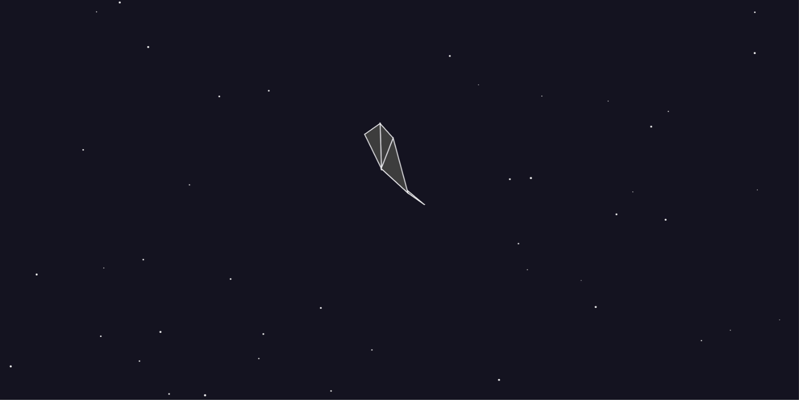

# Balls Render
Simple program in p5js to render balls that create triangles when close enough

# Demonstration

# Download
For the source code, simply run `git clone https://github.com/CharlotteCross1998/balls-render.git`

# Contributing

This code is meant to be as an example for others to build on, however I will accept contributions that fix bugs or add features that may extend the program, for example, adding attraction when balls are in a close enough range to create the triangle.
